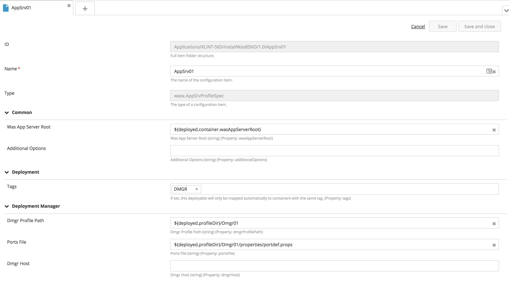
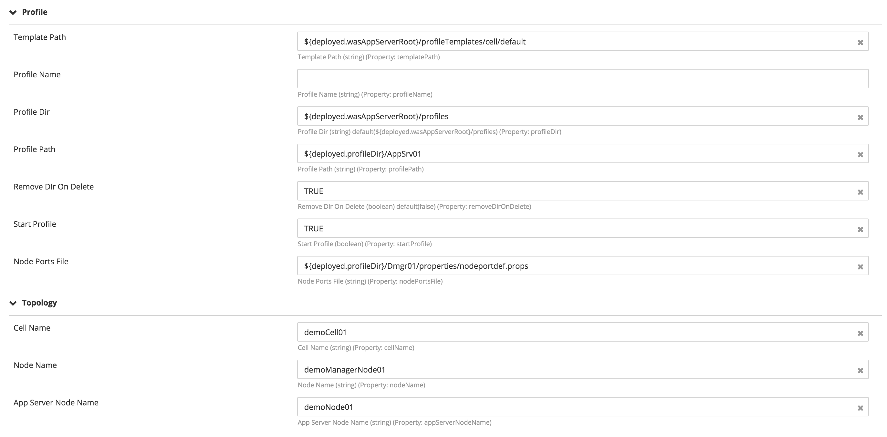
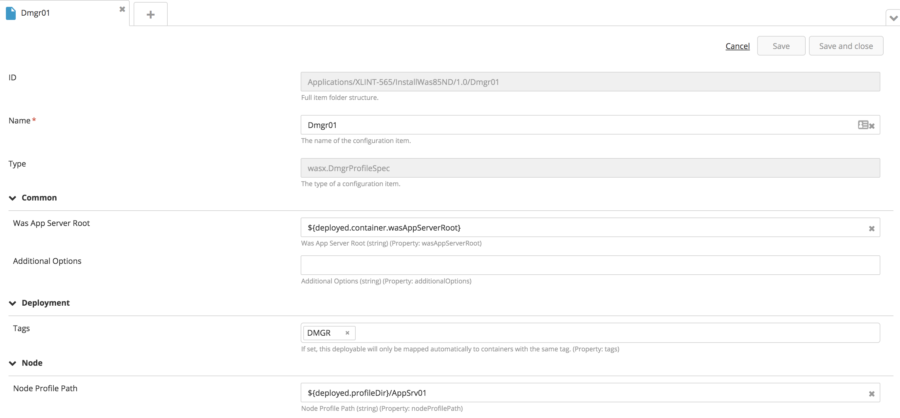
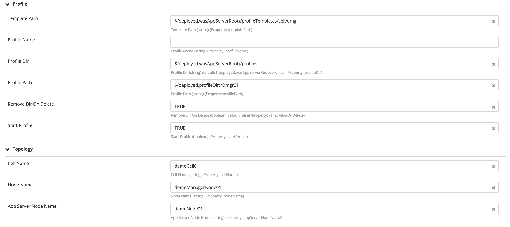

# XL Deploy WAS profile plugin

This plugin will create and optionally start WAS profiles.  The start actions are startNode for a Application Server profile and startManager for a Deployment Manager profile

[![Build Status][xld-was-profile-plugin-travis-image]][xld-was-profile-plugin-travis-url]
[![License: MIT][xld-was-profile-plugin-license-image]][xld-was-profile-plugin-license-url]
![Github All Releases][xld-was-profile-plugin-downloads-image]

[xld-was-profile-plugin-travis-image]: https://travis-ci.org/xebialabs-community/xld-was-profile-plugin.svg?branch=master
[xld-was-profile-plugin-travis-url]: https://travis-ci.org/xebialabs-community/xld-was-profile-plugin
[xld-was-profile-plugin-license-image]: https://img.shields.io/badge/License-MIT-yellow.svg
[xld-was-profile-plugin-license-url]: https://opensource.org/licenses/MIT
[xld-was-profile-plugin-downloads-image]: https://img.shields.io/github/downloads/xebialabs-community/xld-was-profile-plugin/total.svg

## Preface

This document describes the functionality provided by the XL Deploy|Release Description|Interface plugin.

See the [XL Deploy reference manual](https://docs.xebialabs.com/xl-deploy) for background information on XL Deploy and deployment automation concepts.  

## Overview

## Requirements

XL Deploy 8.0+

## Objects ##

### wasx.WasProfileContainer ###

This is the container to which the WAS profiles will be deployed.

#### Properties ####

**WasAppServerRoot** = the WAS installation root, for example, /opt/IBM/WebShere/Appserver

### wasx.AppSrvProfileSpec ###
Specification for a WAS Application Server profile.

#### Properties ####

**templatePath** = the location of the profile template, for example, ```${deployed.wasAppServerRoot}/profileTemplates/cell/default```

**profileName** = the name to be assigned to the template (if not entered, the name of the object will be used)

**wasAppServerRoot** = the WAS installation root

**profileDir** = the directory into which to write the profile, for example, ```${deployed.wasAppServerRoot}/profiles```

**profilePath** = the path to the profile, for example, ```${deployed.profileDir}/AppSrv01```

**removeDirOnDelete** = boolean value to control whether a rmdir is executed after a profile is deleted

**dmgrProfilePath** = the path to the deployment manager profile

**portsFile** = the ports file, for example, ```${deployed.profileDir}/Dmgr01/properties/portdef.props```

**nodePortsFile** = the node ports file, for example, ```${deployed.profileDir}/Dmgr01/properties/nodeportdef.props```

**startProfile** = boolean value to control whether the new profile is started

**dmgrHost** = the location of the deployment manager host for node federation

**cellName** = the name of the cell

**nodeName** = the name of the node on which dmgr is running

**appServerNodeName** = the name of the appserver node




### wasx.DmgrProfileSpec ###

Specification for a WAS Application Server profile.

#### Properties ####

**templatePath** = the location of the profile template, for example, ```${deployed.wasAppServerRoot}/profileTemplates/cell/default```

**profileName** = the name to be assiged to the template (if not entered, the name of the object will be used)

**wasAppServerRoot** = the WAS installation root

**profileDir** = the directory into which to write the profile, for example, ```${deployed.wasAppServerRoot}/profiles```

**profilePath** = the path to the profile, for example, ```${deployed.profileDir}/AppSrv01```

**removeDirOnDelete** = boolean value to control whether a rmdir is executed after a profile is deleted

**nodeProfilePath** = the path to the appserver profile

**startProfile** = boolean value to control whether the new profile is started

**cellName** = the name of the cell

**nodeName** = the name of the node on which dmgr is running

**appServerNodeName** = the name of the appserver node




